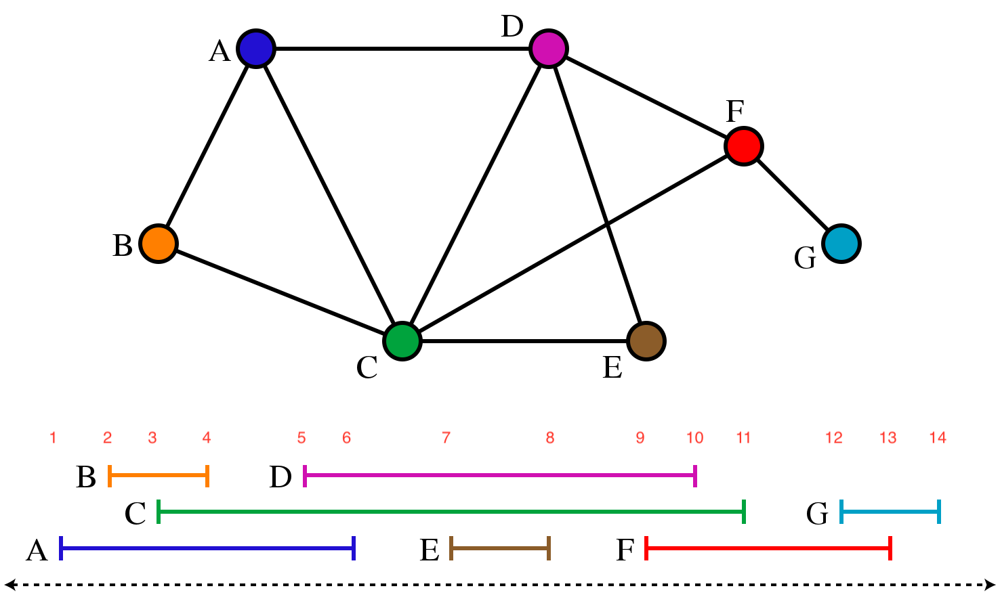

## Playing around with Java and interval graphs

### Introduction

The exercise: Given a set of named of intervals construct an interval graph that may be interrogated thus:

1. For the entire graph, yield the set of intervals. 
2. For a given interval, yield all overlapping intervals.
3. Check the graph's consistency (always consistent).

Plus, to build a graph and change it dynamically

4. Add an interval.
5. Delete an interval.

Bonus, still to do

6. For a given point in time return all the 
overlapping intervals 
7. Build a RESTful interface to add intervals
8. Build a RESTful interface to obtain the current graph
OR get the changes since the last sampling of the graph
   (obviously there needs to a way to get an intial graph
   if changes are the way to go).
9. Introduce the notion of time and remove intervals 
that have have completed before that time (tick the time appropriately)

### Input

Named intervals appear in a text file one per line in the format

`Name NumericStart NumericEnd`

thus

```
A 2 14
Snodgrass 3 5
```

Currently the file is 

`<project root dir>/input/intervals01.txt`

and this needs to be generalised in some way not yet designed.

### Approaches to implementing an interval graph

An undirected graph may be implemented in at least three common ways.

Either we might 

1. Build an adjacency matrix 
(space inefficient for large graphs).
2. Build an adjacency list
(time inefficient).
3. Reimplement part of a graph database  
like Node4j. 

Or we might run, say,

4. [Google Guava](https://github.com/google/guava/wiki/GraphsExplained).
5. [Apache Commons Gigraph](https://giraph.apache.org/) but, for now time is too short to 
[set up a Hadoop instance on a virtual machine and then run Gigraph on it](https://giraph.apache.org/quick_start.html)
&mdash; next thing I'm deep in setting up Maven builds, which is doable, but is a slog  when things go wrong.

The easiest would be to re-use [Baeldung's adjacency list code](https://www.baeldung.com/java-graphs), but what's the fun in that?

So instead I'll go with implementing my own adjacency list code in this repo.


### Compilation

Requires:

1. Hamcrest jar to be installed on the class path in order
to compile (at least some of) the tests.
2. Apache lang utils to be installed on the class path in order
   to use its hashing functionality in the Interval class, so intervals can be used in a HashMap.

### Notes on 'finishing for now' aka current state of play


Notes:



1. used the [wikipedia example](https://en.wikipedia.org/wiki/Interval_graph) augmented with non-intersecting interval 'H'.
2. Output is good, see below.
3. Some todos, grep for them in the code. 
4. Not that pleased that my test package is under directory 'src' and not under directory 'test'.
5. Reasonably well tested except for a couple of utility functions.
6. Most JavaDoc is in place
7. Fairly pleased after not touching Java for years.

### Output from running main

Format has changed a bit

```
Parsing the interval data
A 1 6
B 2 4
C 3 11
D 5 10
E 7 8
F 9 13
G 12 14
H 15 16
Building the interval graph
Listing intersecting intervals for each interval
Intersecting intervals for interval A
interval [B, 2, 4]
interval [C, 3, 11]
interval [D, 5, 10]
Intersecting intervals for interval B
interval [A, 1, 6]
interval [C, 3, 11]
Intersecting intervals for interval C
interval [A, 1, 6]
interval [B, 2, 4]
interval [D, 5, 10]
interval [E, 7, 8]
interval [F, 9, 13]
Intersecting intervals for interval D
interval [A, 1, 6]
interval [C, 3, 11]
interval [E, 7, 8]
interval [F, 9, 13]
Intersecting intervals for interval E
interval [C, 3, 11]
interval [D, 5, 10]
Intersecting intervals for interval F
interval [C, 3, 11]
interval [D, 5, 10]
interval [G, 12, 14]
Intersecting intervals for interval G
interval [F, 9, 13]
Intersecting intervals for interval H
no intersecting intervals

Process finished with exit code 0
```


